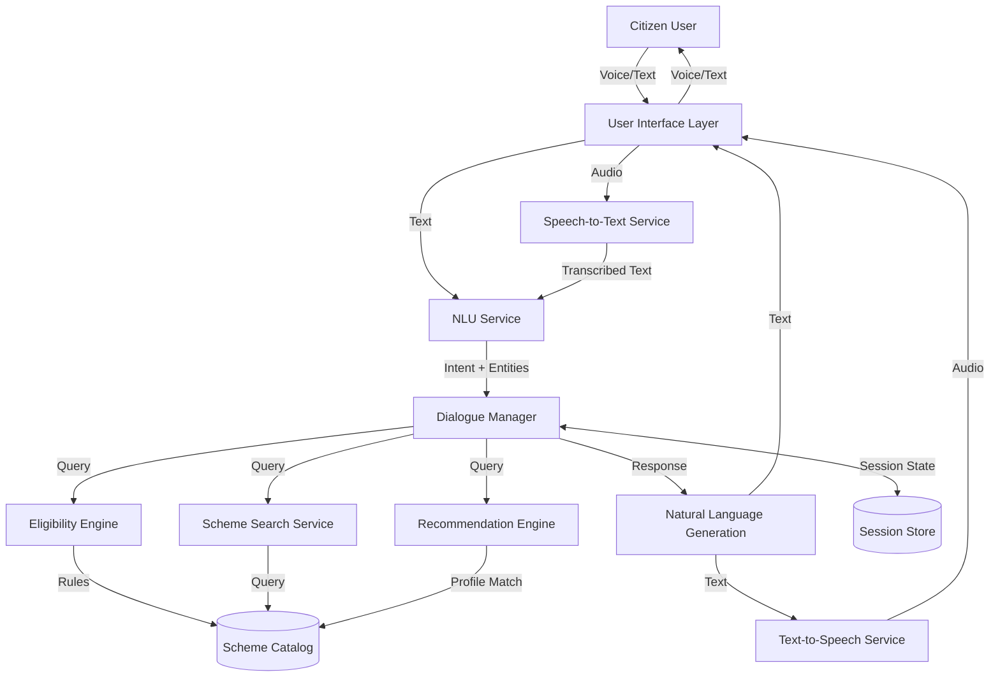

# Design Document: SevaSetu AI Platform

## 1. Overview

SevaSetu AI is a multilingual, voice-first conversational platform that connects Indian citizens with government welfare schemes and public services. The system architecture follows a modular design with clear separation between natural language processing, business logic, and data layers.

**Core Design Principles**:
- **Voice-First**: Optimized for voice interaction with text as secondary modality
- **Language-Agnostic Core**: Business logic independent of language, with language handling at interface layer
- **Stateless Services**: Horizontally scalable microservices architecture
- **Privacy by Design**: Minimal data collection, encryption by default, no persistent user accounts
- **Graceful Degradation**: System remains functional with reduced capabilities when components fail

**Technology Stack** (Recommended for Hackathon):
- **NLP Foundation**: IndicBERT (AI4Bharat) for multilingual understanding
- **Speech Services**: Sarvam AI or Google Cloud Speech APIs for Indian languages
- **Backend**: Python with FastAPI for REST services
- **Database**: PostgreSQL for scheme catalog, Redis for session management
- **Deployment**: Docker containers, cloud-agnostic design

## 2. Architecture

### 2.1 High-Level Architecture



### 2.2 Architectural Layers

**Layer 1: Interface Layer**
- Web-based responsive UI supporting mobile and desktop
- Voice input/output controls
- Text input fallback
- Language selection interface
- Accessibility controls (text size, contrast, screen reader support)

**Layer 2: Natural Language Processing Layer**
- Speech-to-Text (STT) service for voice input
- Natural Language Understanding (NLU) for intent and entity extraction
- Natural Language Generation (NLG) for response formatting
- Text-to-Speech (TTS) service for voice output
- Language detection and code-mixing handling

**Layer 3: Conversation Management Layer**
- Dialogue Manager orchestrating conversation flow
- Session management maintaining conversation context
- Intent routing to appropriate services
- Response composition and formatting

**Layer 4: Business Logic Layer**
- Scheme Search Service for discovery
- Eligibility Engine for qualification assessment
- Recommendation Engine for personalized suggestions
- Application Guidance Service for step-by-step instructions

**Layer 5: Data Layer**
- Scheme Catalog database with structured scheme information
- Session Store for temporary conversation state
- Analytics Store for usage metrics and improvement

### 2.3 Data Flow

**Voice Query Flow**:
1. User speaks query in Hindi/Tamil/English
2. STT service transcribes to text with language detection
3. NLU extracts intent (e.g., "find_schemes") and entities (e.g., age=65, occupation=farmer)
4. Dialogue Manager retrieves session context and routes to appropriate service
5. Service (Search/Eligibility/Recommendation) processes request using Scheme Catalog
6. NLG formats response in user's language
7. TTS converts to speech
8. Audio and text returned to user

**Text Query Flow**:
Similar to voice flow but skips STT and TTS steps.

## 3. Components and Interfaces

### 3.1 User Interface Component

**Responsibilities**:
- Render conversational interface
- Capture voice and text input
- Display text responses and play audio responses
- Manage accessibility settings
- Handle offline state gracefully

**Interface**:
```python
class UserInterface:
    def capture_voice_input() -> AudioData
    def capture_text_input() -> str
    def display_response(text: str, audio: Optional[AudioData])
    def set_language(language_code: str)
    def set_accessibility_options(options: AccessibilityConfig)
```

### 3.2 Speech-to-Text Service

**Responsibilities**:
- Convert audio to text
- Detect spoken language
- Handle background noise and accents
- Provide confidence scores

**Technology**: Sarvam AI ASR API or Google Cloud Speech-to-Text

**Interface**:
```python
class STTService:
    def transcribe(audio: AudioData, language_hint: Optional[str]) -> TranscriptionResult
    
class TranscriptionResult:
    text: str
    language: str  # ISO 639-1 code
    confidence: float  # 0.0 to 1.0
    alternatives: List[str]  # Alternative transcriptions
```

### 3.3 Natural Language Understanding Service

**Responsibilities**:
- Extract user intent from text
- Identify and extract entities (age, income, location, etc.)
- Handle multilingual input
- Resolve ambiguities through context

**Technology**: IndicBERT fine-tuned for intent classification and NER

**Intents**:
- `find_schemes`: User wants to discover schemes
- `check_eligibility`: User wants to know if they qualify
- `get_application_info`: User wants application guidance
- `get_scheme_details`: User wants detailed information about specific scheme
- `list_documents`: User wants to know required documents
- `help`: User needs assistance
- `repeat`: User wants previous response repeated
- `change_language`: User wants to switch language

**Entities**:
- `age`: Integer or range
- `income`: Amount with currency
- `location`: State, district, or pin code
- `occupation`: Job category
- `caste_category`: SC/ST/OBC/General
- `gender`: Male/Female/Other
- `scheme_name`: Name of specific scheme
- `scheme_category`: Education/Healthcare/Agriculture/Housing/Pension/Employment

**Interface**:
```python
class NLUService:
    def understand(text: str, language: str, context: SessionContext) -> NLUResult
    
class NLUResult:
    intent: str
    confidence: float
    entities: Dict[str, Any]
    requires_clarification: bool
    clarification_question: Optional[str]
```

### 3.4 Dialogue Manager

**Responsibilities**:
- Orchestrate conversation flow
- Maintain session context
- Route intents to appropriate services
- Handle multi-turn conversations
- Manage clarification dialogues
- Implement fallback strategies

**State Management**:
- Session ID for tracking conversations
- User profile (age, location, etc.) collected during conversation
- Conversation history (last N turns)
- Current intent and entities
- Pending clarifications

**Interface**:
```python
class DialogueManager:
    def process_turn(nlu_result: NLUResult, session_id: str) -> DialogueResponse
    def get_session(session_id: str) -> SessionContext
    def update_session(session_id: str, updates: Dict[str, Any])
    def clear_session(session_id: str)
    
class SessionContext:
    session_id: str
    language: str
    user_profile: UserProfile
    conversation_history: List[Turn]
    current_intent: Optional[str]
    pending_entities: List[str]
    
class DialogueResponse:
    text: str
    requires_user_input: bool
    suggested_actions: List[str]
    schemes: Optional[List[Scheme]]
```

### 3.5 Scheme Search Service

**Responsibilities**:
- Search schemes by keywords, categories, or natural language queries
- Rank results by relevance
- Filter by basic criteria
- Return scheme summaries

**Search Strategies**:
- Keyword matching on scheme name and description
- Category-based filtering
- Semantic search using embeddings (if time permits)
- Fuzzy matching for typo tolerance

**Interface**:
```python
class SchemeSearchService:
    def search(query: str, category: Optional[str], limit: int) -> List[SchemeResult]
    def get_scheme_by_id(scheme_id: str) -> Scheme
    def get_schemes_by_category(category: str) -> List[Scheme]
    
class SchemeResult:
    scheme: Scheme
    relevance_score: float
    match_reason: str  # Why this scheme was returned
```

### 3.6 Eligibility Engine

**Responsibilities**:
- Evaluate user eligibility for schemes
- Apply rule-based criteria matching
- Identify missing information needed for assessment
- Explain eligibility decisions

**Rule Representation**:
Each scheme has eligibility rules represented as structured criteria:

```python
class EligibilityRule:
    field: str  # e.g., "age", "income", "location"
    operator: str  # e.g., ">=", "<=", "==", "in", "not_in"
    value: Any  # e.g., 60, 500000, ["Maharashtra", "Gujarat"]
    required: bool  # Must be satisfied vs. optional
    
class EligibilityCriteria:
    scheme_id: str
    rules: List[EligibilityRule]
    logic: str  # "AND" or "OR" for combining rules
```

**Evaluation Algorithm**:
1. Collect user profile from session context
2. Retrieve eligibility criteria for scheme
3. For each rule, check if user profile satisfies condition
4. If information missing, mark as "needs_clarification"
5. Combine rule results using specified logic (AND/OR)
6. Return eligibility decision with explanation

**Interface**:
```python
class EligibilityEngine:
    def check_eligibility(scheme_id: str, user_profile: UserProfile) -> EligibilityResult
    def get_missing_info(scheme_id: str, user_profile: UserProfile) -> List[str]
    
class EligibilityResult:
    eligible: bool
    confidence: float  # 1.0 if all info available, lower if assumptions made
    explanation: str  # Human-readable explanation
    failed_criteria: List[str]  # Which criteria not met
    missing_info: List[str]  # What information is needed
```

### 3.7 Recommendation Engine

**Responsibilities**:
- Suggest relevant schemes based on user profile
- Rank schemes by relevance and benefit potential
- Explain why schemes are recommended
- Avoid overwhelming users with too many suggestions

**Recommendation Strategy**:
1. **Profile-Based Filtering**: Filter schemes where user meets basic eligibility
2. **Relevance Scoring**: Score schemes based on:
   - Eligibility match strength (how well user fits criteria)
   - Benefit magnitude (financial value or impact)
   - Popularity (usage statistics if available)
   - Recency (newer schemes ranked higher)
3. **Diversity**: Ensure recommendations span multiple categories
4. **Limit**: Return top 5 recommendations maximum

**Interface**:
```python
class RecommendationEngine:
    def recommend(user_profile: UserProfile, limit: int = 5) -> List[Recommendation]
    
class Recommendation:
    scheme: Scheme
    relevance_score: float
    reason: str  # Why recommended
    estimated_benefit: Optional[str]  # e.g., "₹50,000 per year"
```

### 3.8 Natural Language Generation Service

**Responsibilities**:
- Format responses in natural, conversational language
- Adapt language complexity for target audience
- Support multiple Indian languages
- Generate explanations for eligibility decisions
- Create step-by-step application guidance

**Generation Strategies**:
- Template-based generation for structured responses (eligibility results, scheme lists)
- Rule-based generation for explanations
- Language-specific templates for each supported language

**Interface**:
```python
class NLGService:
    def generate_response(dialogue_response: DialogueResponse, language: str) -> str
    def format_scheme_list(schemes: List[Scheme], language: str) -> str
    def format_eligibility_result(result: EligibilityResult, language: str) -> str
    def format_application_guidance(scheme: Scheme, language: str) -> str
```

### 3.9 Text-to-Speech Service

**Responsibilities**:
- Convert text to natural-sounding speech
- Support multiple Indian languages
- Handle code-mixed text
- Provide appropriate voice (male/female options)

**Technology**: Sarvam AI Bulbul TTS or Google Cloud Text-to-Speech

**Interface**:
```python
class TTSService:
    def synthesize(text: str, language: str, voice_config: VoiceConfig) -> AudioData
    
class VoiceConfig:
    gender: str  # "male" or "female"
    speed: float  # 0.5 to 2.0
    pitch: float  # -20 to 20
```

## 4. Data Models

### 4.1 Scheme Model

```python
class Scheme:
    scheme_id: str  # Unique identifier
    name: Dict[str, str]  # {"en": "PM-KISAN", "hi": "पीएम-किसान", "ta": "பிஎம்-கிசான்"}
    description: Dict[str, str]  # Multilingual descriptions
    category: str  # "agriculture", "healthcare", "education", etc.
    benefits: Dict[str, str]  # Multilingual benefit descriptions
    eligibility_criteria: EligibilityCriteria
    required_documents: List[Dict[str, str]]  # Multilingual document names
    application_process: Dict[str, str]  # Multilingual step-by-step guide
    official_url: str  # Link to government portal
    contact_info: ContactInfo
    last_updated: datetime
    status: str  # "active", "suspended", "closed"
    
class ContactInfo:
    helpline: Optional[str]
    email: Optional[str]
    office_address: Optional[str]
```

### 4.2 User Profile Model

```python
class UserProfile:
    age: Optional[int]
    age_range: Optional[str]  # "18-25", "60+", etc.
    gender: Optional[str]
    location: Location
    income: Optional[int]  # Annual income in INR
    income_bracket: Optional[str]  # "below_poverty_line", "low_income", etc.
    occupation: Optional[str]
    occupation_category: Optional[str]  # "farmer", "daily_wage", "self_employed", etc.
    caste_category: Optional[str]  # "SC", "ST", "OBC", "General"
    disability: Optional[bool]
    education_level: Optional[str]
    family_size: Optional[int]
    land_ownership: Optional[float]  # In acres, for agricultural schemes
    
class Location:
    state: Optional[str]
    district: Optional[str]
    pin_code: Optional[str]
    rural_urban: Optional[str]  # "rural" or "urban"
```

### 4.3 Session Model

```python
class Session:
    session_id: str
    created_at: datetime
    last_activity: datetime
    language: str  # Current language
    user_profile: UserProfile
    conversation_history: List[Turn]
    current_state: str  # "greeting", "collecting_info", "showing_results", etc.
    
class Turn:
    timestamp: datetime
    user_input: str
    nlu_result: NLUResult
    system_response: str
    schemes_shown: List[str]  # Scheme IDs
```

### 4.4 Analytics Model

```python
class UsageEvent:
    event_id: str
    timestamp: datetime
    session_id: str
    event_type: str  # "session_start", "query", "scheme_view", "eligibility_check", etc.
    language: str
    user_demographics: Dict[str, Any]  # Anonymized demographics
    intent: Optional[str]
    schemes_interacted: List[str]
    success: bool  # Whether user found what they needed
```

## 5. Correctness Properties

*A property is a characteristic or behavior that should hold true across all valid executions of a system—essentially, a formal statement about what the system should do. Properties serve as the bridge between human-readable specifications and machine-verifiable correctness guarantees.*

### Property 1: Language Consistency

*For any* conversation session, all system responses within that session should be in the same language as the user's most recent language selection or detected input language.

**Validates: Requirements 1.1, 1.2, 1.3, 1.4, 1.5**

### Property 2: Scheme Discovery Completeness

*For any* user query describing needs or situation, if matching schemes exist in the catalog, the system should return at least one relevant scheme.

**Validates: Requirements 2.1, 2.2**

### Property 3: Eligibility Consistency

*For any* user profile and scheme, if the user meets all eligibility criteria, the system should confirm eligibility; if any required criterion is not met, the system should indicate ineligibility with explanation.

**Validates: Requirements 3.1, 3.2, 3.3, 3.4**

### Property 4: Information Completeness

*For any* scheme returned to the user, the response should include scheme name, brief description, and eligibility summary at minimum.

**Validates: Requirements 2.3**

### Property 5: Voice Round-Trip Accuracy

*For any* voice input that is successfully transcribed, the transcribed text should preserve the semantic intent of the original speech such that NLU can extract the correct intent.

**Validates: Requirements 5.1, 5.2**

### Property 6: Recommendation Relevance

*For any* user profile provided, all recommended schemes should have at least one eligibility criterion that the user satisfies.

**Validates: Requirements 6.1, 6.2**

### Property 7: Context Preservation

*For any* multi-turn conversation, when a user refers to information mentioned in previous turns (e.g., "tell me more about that scheme"), the system should correctly resolve the reference using conversation history.

**Validates: Requirements 7.1, 7.2, 7.3, 7.4**

### Property 8: Fallback Helpfulness

*For any* query where the system cannot determine intent with confidence above threshold, the system should provide a fallback response that includes help text or suggested alternatives.

**Validates: Requirements 8.1, 8.2, 8.5**

### Property 9: Accessibility Text Size

*For any* text displayed in the interface, when the user selects a larger text size option, all text elements should increase proportionally while maintaining readability.

**Validates: Requirements 9.2**

### Property 10: Data Encryption

*For any* personally identifiable information collected from users, the data should be encrypted both during transmission (HTTPS) and at rest (database encryption).

**Validates: Requirements 10.1**

### Property 11: Privacy Minimization

*For any* eligibility assessment, the system should request only the specific information fields required by that scheme's eligibility criteria, not all possible profile fields.

**Validates: Requirements 10.2, 10.3**

### Property 12: Offline Graceful Degradation

*For any* cached scheme in local storage, when the system is offline, the user should still be able to view that scheme's information.

**Validates: Requirements 11.1, 11.3**

### Property 13: Scheme Information Freshness

*For any* scheme displayed to users, the system should show the last updated date, and this date should be within 48 hours of any official changes to the scheme.

**Validates: Requirements 12.1, 12.3**

### Property 14: Response Time Performance

*For any* text query under normal load conditions, the system should return a response within 3 seconds for 90% of requests.

**Validates: Requirements 13.1**

### Property 15: Intent Recognition Accuracy

*For any* set of 100 diverse user queries in supported languages, the NLU service should correctly identify the intent for at least 80 queries.

**Validates: Requirements 16.1**

### Property 16: Multilingual Parity

*For any* supported language, the quality of intent recognition and entity extraction should not differ by more than 10% accuracy compared to other supported languages.

**Validates: Requirements 22.1**

### Property 17: Bias-Free Recommendations

*For any* two user profiles that differ only in gender or caste category but are otherwise identical, the recommended schemes should be identical (assuming schemes don't have gender/caste-specific eligibility).

**Validates: Requirements 18.1, 18.3, 22.2**

### Property 18: Explanation Transparency

*For any* eligibility decision (eligible or ineligible), the system response should include an explanation referencing the specific criteria that were evaluated.

**Validates: Requirements 21.1, 21.4**

### Property 19: Simple Language Usage

*For any* system-generated response, the text should use vocabulary and sentence structures appropriate for Grade 6 reading level or below (excluding technical terms that must be preserved).

**Validates: Requirements 25.3, 26.2**

### Property 20: Voice-Only Completeness

*For any* user journey (scheme discovery, eligibility check, application guidance), the user should be able to complete the entire journey using only voice input and output without requiring visual interface interaction.

**Validates: Requirements 9.5, 26.1**

## 6. Error Handling

### 6.1 Error Categories

**User Input Errors**:
- Unclear or ambiguous speech
- Unsupported language
- Incomplete information
- Invalid entity values (e.g., negative age)

**System Errors**:
- STT/TTS service unavailable
- NLU model failure
- Database connection failure
- External API timeout

**Data Errors**:
- Scheme information missing or incomplete
- Eligibility rules malformed
- Inconsistent data across languages

### 6.2 Error Handling Strategies

**Graceful Degradation**:
- If STT fails, fall back to text input
- If TTS fails, provide text-only response
- If NLU confidence low, ask clarifying questions
- If database unavailable, use cached data

**User-Friendly Messages**:
- Avoid technical jargon in error messages
- Provide actionable next steps
- Offer alternative ways to accomplish goal
- Include human assistance contact information

**Retry Logic**:
- Automatic retry for transient failures (network timeouts)
- Exponential backoff for API calls
- Circuit breaker pattern for failing services

**Logging and Monitoring**:
- Log all errors with context for debugging
- Track error rates by component
- Alert on error rate spikes
- Maintain error dashboard for monitoring

### 6.3 Specific Error Scenarios

**Scenario 1: Speech Recognition Failure**
- **Trigger**: STT service returns low confidence or error
- **Response**: "I'm sorry, I couldn't hear that clearly. Could you please repeat or type your question?"
- **Fallback**: Switch to text input mode

**Scenario 2: Intent Recognition Failure**
- **Trigger**: NLU confidence below 0.6
- **Response**: "I'm not sure I understood. Are you looking to: (1) Find schemes, (2) Check eligibility, or (3) Get application help?"
- **Fallback**: Provide menu of common intents

**Scenario 3: Missing Eligibility Information**
- **Trigger**: User profile lacks required fields for eligibility check
- **Response**: "To check if you're eligible, I need to know your [age/income/location]. Could you share that?"
- **Fallback**: Ask specific questions to collect missing data

**Scenario 4: No Schemes Found**
- **Trigger**: Search returns zero results
- **Response**: "I couldn't find schemes matching '[query]'. You might try searching for [category suggestions] or ask me to show all available schemes."
- **Fallback**: Suggest broader categories or show popular schemes

**Scenario 5: Database Unavailable**
- **Trigger**: Cannot connect to scheme catalog
- **Response**: "I'm having trouble accessing scheme information right now. Please try again in a few minutes or visit [official government portal]."
- **Fallback**: Provide cached data if available, or government helpline number

**Scenario 6: Session Timeout**
- **Trigger**: User inactive for >30 minutes
- **Response**: "Your session has expired for security. Let's start fresh—how can I help you today?"
- **Fallback**: Clear session and restart conversation

## 7. Testing Strategy

### 7.1 Testing Approach

The testing strategy employs a dual approach combining unit tests for specific scenarios and property-based tests for universal correctness guarantees.

**Unit Tests**: Focus on specific examples, edge cases, and integration points
**Property Tests**: Verify universal properties across randomized inputs

### 7.2 Unit Testing

**Component-Level Tests**:
- NLU Service: Test intent recognition for sample queries in each language
- Eligibility Engine: Test rule evaluation with known user profiles
- Dialogue Manager: Test conversation flow for common scenarios
- Search Service: Test keyword matching and ranking
- Recommendation Engine: Test scoring algorithm with sample profiles

**Integration Tests**:
- End-to-end conversation flows for key user journeys
- API integration tests for STT/TTS services
- Database query performance tests
- Session management across multiple turns

**Edge Case Tests**:
- Empty or whitespace-only input
- Extremely long input (>1000 characters)
- Special characters and emojis
- Code-mixed input (Hindi-English combinations)
- Rapid language switching
- Concurrent sessions from same user

**Error Condition Tests**:
- STT service timeout
- Invalid audio format
- Malformed scheme data
- Missing required fields
- Database connection failure

### 7.3 Property-Based Testing

**Configuration**: Minimum 100 iterations per property test using appropriate PBT library (Hypothesis for Python)

**Property Test 1: Language Consistency**
- **Generator**: Random conversation with language switches
- **Property**: All responses in same language as last user input
- **Tag**: Feature: sevasetu-ai-platform, Property 1: Language Consistency

**Property Test 2: Scheme Discovery Completeness**
- **Generator**: Random user queries with known matching schemes
- **Property**: At least one relevant scheme returned when matches exist
- **Tag**: Feature: sevasetu-ai-platform, Property 2: Scheme Discovery Completeness

**Property Test 3: Eligibility Consistency**
- **Generator**: Random user profiles and schemes
- **Property**: Eligibility decision matches rule evaluation
- **Tag**: Feature: sevasetu-ai-platform, Property 3: Eligibility Consistency

**Property Test 4: Information Completeness**
- **Generator**: Random scheme queries
- **Property**: All returned schemes include name, description, eligibility summary
- **Tag**: Feature: sevasetu-ai-platform, Property 4: Information Completeness

**Property Test 5: Context Preservation**
- **Generator**: Random multi-turn conversations with references
- **Property**: References correctly resolved using history
- **Tag**: Feature: sevasetu-ai-platform, Property 7: Context Preservation

**Property Test 6: Recommendation Relevance**
- **Generator**: Random user profiles
- **Property**: All recommendations match at least one eligibility criterion
- **Tag**: Feature: sevasetu-ai-platform, Property 6: Recommendation Relevance

**Property Test 7: Privacy Minimization**
- **Generator**: Random eligibility checks
- **Property**: Only required fields requested for each scheme
- **Tag**: Feature: sevasetu-ai-platform, Property 11: Privacy Minimization

**Property Test 8: Bias-Free Recommendations**
- **Generator**: Pairs of profiles differing only in protected attributes
- **Property**: Identical recommendations for equivalent profiles
- **Tag**: Feature: sevasetu-ai-platform, Property 17: Bias-Free Recommendations

**Property Test 9: Explanation Transparency**
- **Generator**: Random eligibility decisions
- **Property**: All decisions include criterion-based explanation
- **Tag**: Feature: sevasetu-ai-platform, Property 18: Explanation Transparency

**Property Test 10: Simple Language Usage**
- **Generator**: Random system responses
- **Property**: Reading level at Grade 6 or below (using readability metrics)
- **Tag**: Feature: sevasetu-ai-platform, Property 19: Simple Language Usage

### 7.4 Accessibility Testing

- Screen reader compatibility testing (NVDA, JAWS)
- Keyboard-only navigation testing
- Color contrast validation (WCAG 2.1 AA)
- Text scaling testing (up to 200%)
- Voice-only interaction testing with diverse accents

### 7.5 Performance Testing

- Load testing: 100 concurrent users
- Response time measurement under load
- Database query optimization
- API rate limit handling
- Memory leak detection

### 7.6 Bias and Fairness Testing

- Demographic parity testing across gender, caste, region
- Recommendation quality comparison across languages
- Intent recognition accuracy by demographic group
- Manual review of edge cases with diverse test users

### 7.7 User Acceptance Testing

- Testing with representative users from target demographics
- Usability testing with elderly users
- Voice interaction testing with low-literacy users
- Feedback collection on language quality and naturalness
- Task completion rate measurement

---

**Document Version**: 1.0  
**Last Updated**: 2024  
**Status**: Draft for Review
